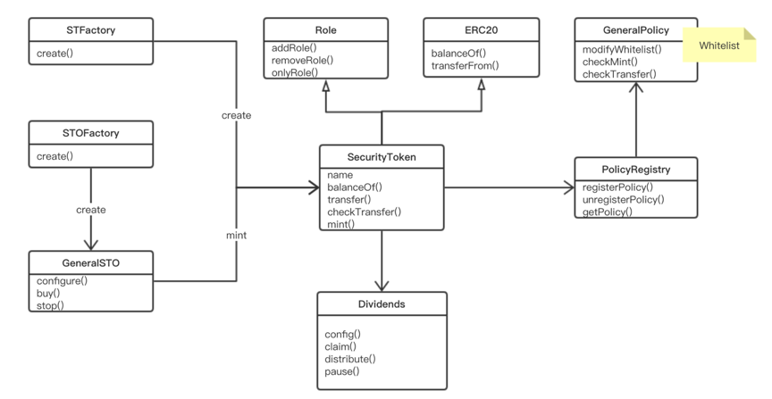

?> This section will describe the core contract of OpenSecurities,how it is structured,designed,coded ...

!> The contract code is located in this [git repository](https://github.com/opensecurities-ose/ose-core)

## Structure of Contract


```text
.
└── ose-core
    ├── contracts //the contract code
        ├── dex //the dex contracts
        ├── interfaces
        ├── libraries
        ├── modules
        ├── multisig
        ├── policies
        ├── stos
    ├── play //the playground of the contract interface
    ├── docs //the docs of OpenSecurities
    ├── javaDemo //the demo to show how to call the contract
    ├── test //the test directories
    ├── utils //some help utils
    
```

!> The project depends on `truflle @v4.1.14`, `solidity @v0.4.24`, and `ganache-cli` to simulate the ethereum private network

## Main Contracts


?> Let's take look at the frame of contracts




> Now we will dig into the contract code to make it clear how it works


### SecurityToken

?> This is the implementation of Security Token Standard,which is compatible with ERC20 and ERC-1410.

#### balances

Mapping from investor to aggregated balance across all investor token sets.  
mapping (address investor => uint256 amount) balances;

#### trancheBalances

Mapping from investor to tranche balance token  
mapping (address investor => mapping (bytes32 tranche => uint256 amount)) trancheBalances;

#### trancheApprovals

Mapping from (investor, tranche, operator) to approved status

#### investorTranches

Mapping from investor to their tranches

#### investorDefaultTranche

Mapping from investor to default tranches

#### policies

The policies mapping from id to contract address of the policy

#### allowedTransfer

Mapping from (investor, tranche, operator, amount) to approve transfer

#### getPolicy

get a policy attached to the SecurityToken

#### getTrancheTotalSupply

Counts the trancheTotalSupply associated with a specific tranche

#### balanceOf

Counts the sum of all tranche balances assigned to an owner

#### balanceOfAll

Counts the sum of all tranche balances assigned to an owner

#### balanceOfTranche

Counts the balance associated with a specific tranche assigned to an owner

#### iterateInvestors

List of investors

#### tranchesOf

Enables caller to determine the count of tranches owned by an address

#### registryPolicy

Removes a policy attached to the SecurityToken

#### changeInvestorDefaultTranche

Allows owner to change default tranche for erc20

#### mint

 mints new mocks and assigns them to the target _investor.

#### mintTranche

mints new mocks and assigns them to the target _investor.

#### batchMintTranche

Mints new tokens and assigns them to the target _investor.

#### forceTransfer

Used by a controller to execute a forced transfer

#### forceBurn

Used by a controller to execute a forced burn

#### changeTranche

change user's balance from one tranche to another tranche

#### approveTransferTranche

Approve the passed address to operate the specified amount of mocks on behalf of msg.sender.
Beware that changing an allowance with this method brings the risk that someone may use both the old
and the new allowance by unfortunate transaction ordering.

#### allowanceTransferTranche

Function to check the amount of mocks that an owner allowed to a operator.
