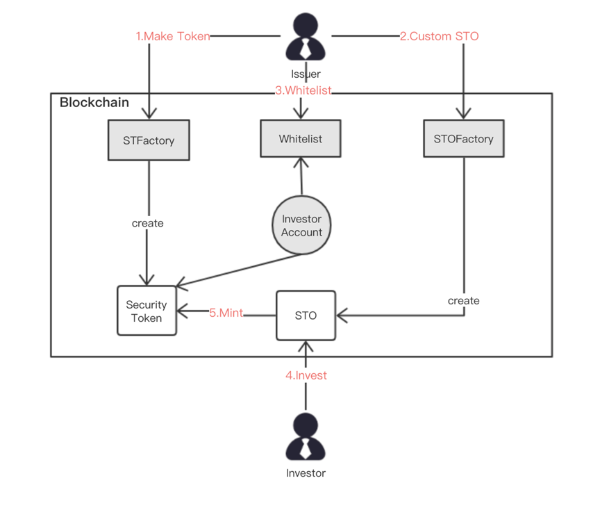
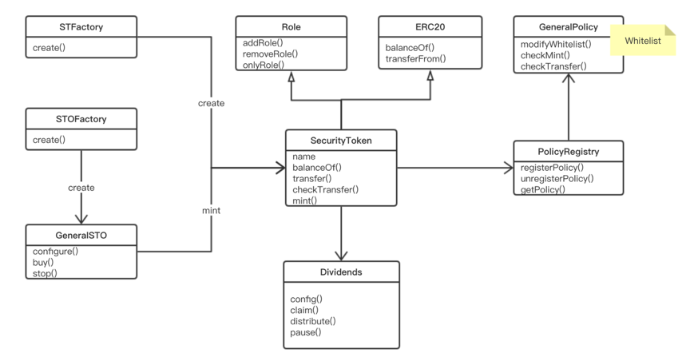

>OpenSecurities consists of two parts, the issuance protocol and the trading protocol, which are responsible for the issuance and trading of security tokens. The issuance protocol is aimed at tokenizing traditional securities. Its defined security token standard supports equity and income security in traditional securities and is compatible with ERC1410 and ERC20 standards in Ethereum.

### Process of Issuance

Participants in the security token issuance include issuers and investors, mainly including the production of tokens, whitelisting and custom distribution. The process is shown in Figure.



1. **Making security tokens:** The issuer sets the security token parameters, calls the interface provided by STFactory, and creates a security token contract.

2. **Configure issuance parameters:** the parameters required by the issuer to set the STO: start time, end time, total issue amount, issue ratio, receiving currency, lock time, etc., generate STO contracts through the interface provided by STOFactory;

3. **Add to the whitelist:** The issuer will add the investor's address to be eligible to participate in the Whitelist contract whitelist to qualify for investment;

4. **Investment:** After the STO begins, investors invest through STO contracts;

5. **Get tokens:** After the investor has successfully invested, he can find his own token amount in the security token contract. After the lock-up period, the investors can transfer the securities;

### The Framework of Issuance Contract

In response to various complex scenarios and demands for securities issuance, the issuance protocol separates the transfer strategy from the security token contract, striving for maximum flexibility and scalability of the contract. The distribution contract framework is shown in Figure.



* **SecurityToken:** the main contract of the issuance protocol, inherited from the Role and ERC20 contracts. Mainly store the user's assets, provides interface for ST's issue/destruction, transfer, agent transfer, transaction control, and role management.

* **Role:** Responsible for role management. eg: create/delete a role, add/remove the user;

* **ERC20:** fungible token standard;

* **GeneralPolicy:** mainly includes ST transfer restrictions, such as which users can not transfer, transfer limit, whitelist, etc;

* **PolicyRegistry:** Responsible for registering the GeneralPolicy contract. The ST contract finds the corresponding GeneralPolicy contract through the PolicyRegistry. In this way, ST  contracts and transfer strategies can be separated for maximum flexibility and scalability.

* **GeneralSTO:** Control the issuance of ST, such as total amount, time of issuance, subscription amount, etc;

* **STFactory/STOFactory:** Responsible for generating ST contracts/STO contracts on-chain;

* **Dividends:** Interest income contract. Applicable to income securities, you can configure income instalments, interest, and provide interest-seeking operations;

### SecurityToken Contract Standard
The SecurityToken contract standard is compatible with both ERC1410 and ERC20. The interface is defined as follows:

```javascripts

pragma solidity ^0.4.24;

///@title Interface of Fungible Security Token
interface IFST is IERC20{
    ///@dev ST can be grouped by tranche.different tranches have different transfer rules
    function balanceOfByTranche(bytes32 _tranche, address _tokenHolder) public view returns (uint256);

    ///@dev get the tranches of user
    function tranchesOf(address _tokenHolder) external view returns (bytes32[]);

    ///@dev send is allowed in the same tranche
    function sendByTranche(bytes32 _tranche, address _to, uint256 _amount, bytes _data) public returns (bytes32);

    ///@dev operator is allowed to transfer ST if is permitted
    function operatorSendByTranche(bytes32 _tranche, address _from, address _to, uint256 _amount, bytes _data, bytes _operatorData) external returns (bytes32);
    ///@dev set the operator
    function authorizeOperator(address operator) public;
    ///@dev remove operator
    function revokeOperator(address operator) public;
    ///@dev check operator
    function isOperatorFor(address operator, address tokenHolder) public view returns (bool);

    ///@dev sender move tranche
    function moveTranche(bytes32 _from, bytes32 _to, uint256 _amount, bytes _data) public returns (bytes32);

    ///@dev check transfer is valid
    function checkTransfer(bytes32 _tranche, address _from, address _to, uint256 _amount, bytes _data) public view returns (bool);
}

```
