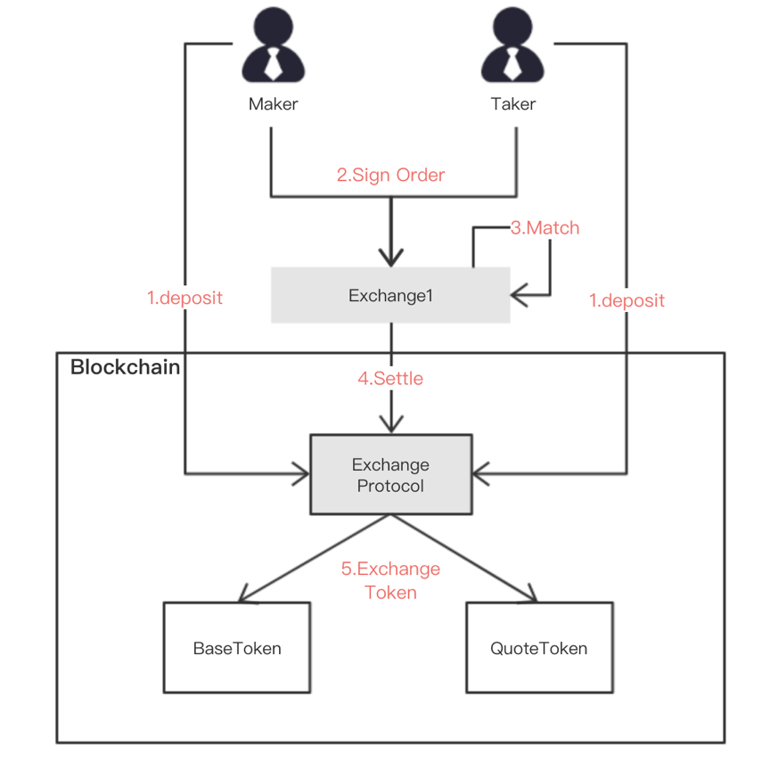

?>In order to improve the ecology of the entire security token, we proposed a decentralized securities trading protocol for the circulation of security tokens to realize the security, transparency and decentralization of securities circulation.


### Process of Trading

The trading protocol is used in the secondary trading market of security tokens, and has the advantages of decentralization, openness and transparency, and liquidity sharing. The process of the trading protocol is shown in Figure below.



1. **Deposit:** Before the transaction, the user needs to transfer the token into the trading contract. The user can transfer the ETH directly to the contract; if the security token is to be transferred to the contract, the user must first grant the agent the right to transfer the transaction, otherwise it will fail. After the transfer is successful, the contract throws a Deposit event, and the exchange can record the recharge by listening to the event.

2. **Order Signing:** When a user submit limit order through the exchange, the order needs to be signed. The signature can be used as a credential for the user' and cannot be modified.

3. **Exchange matching:** After the exchange collects the user's order, it will match the order, and if it meets the matching conditions, it will submit it to the chain trading contract for final settlement;

4. **On-line settlement:** When the transaction contract receives the settlement request of the exchange, it will check whether the order meets the settlement requirements, and if it meets, it will settle
5. **Trading tokens:** The final step in the settlement is to update the respective security tokens of Maker and Taker according to the order's requirements.

### Order Format

>The order submitted by user is signed by the their own private key off-chain, so it can represent the user's order and cannot be tampered with. In order to completely represent the order information when the user places an order, the data that needs to be signed includes:

* **tokenGet:** The contract address  of the token that the user wants to buy,the value 0 means ETH;
* **tokenGive:** The contract address  of the token that the user wants to sell,the value 0 means ETH;
* **amountGet:** the number of tokens that the user wants to buy, in wei;
* **amountGive:** the number of tokens the user wants to sell, in wei;
* **base:** The base token, which is either tokenGet or tokenGive;
* **salt:** random number to ensure that the order ID is unique;
* **version:** The contract version number, which can be represented by the contract address

The process of signing the order by the user's private key is:

```javascripts
order_id=SHA256(version,tokenGet,amountGet,tokenGive,amountGive,base,salt)
signature=web3.eth_sign(order_id,private_key)
```

### Settlement On Chain

The core of the trading protocol is to match the make and taker's orders and settle them. To make the trade method execute successfully, a series of checks are required to ensure the correctness. To do this, you need to do the following verification checks: 

* The purchase order is signed correctly; 
* The purchase order is the same trade pair; 
* Two orders are ask-bid in the opposite direction; 
* The purchase order is not fully filled; 
* The order has not been cancelled; 
* The order’s price matches (buy price>=sell price, then matching is successful); 
* The trade amount submitted by the exchange relayer off-chain is less than the smaller of the unfilled orders; 

!>After the above verifications, the order trade price and the trade quantity are calculated. Finally, the settlement is made to update the balance between the buyer and the seller.

### Withdraw

The trading protocol is decentralized, and the user can withdraw the security token into his wallet at any time. In order to provide a better user experience and ensure the exchange off-chain matches success, The protocol designation requires users to withdraw in two operations.

When the user call the withdraw method at the first time,it will throw  `WithdrawApplication` event;The user can call the method again after 500 blocks(about 2hours) to withdraw success.If the user call the withdraw method before 500 blocks,it will failed.
For the exchange, after the user initiates the withdrawal request and receives the `WithdrawApplication` event, the user's unfilled order should be processed in time.

### Cancel Order

As the order is placed off-chain, the protocol on-chain don't know this. If the user wants to invalidate the signed order that he or she signs, the user needs to cancel the order by call the `cancelOrder` method of the contract. This makes it easy to bring some problems to the exchange's order matching, that is, when the cancellation of the order and the settlement of the order occur at the same time, it may cause the settlement on-chain to fail , which requires additional processing by the exchange. In addition, the order cancellation operation is  frequent, which will consume the user's gas and is not efficient. 

Another more feasible solution is that the exchange can help the user to cancel the order by the user's signed canceling order. In order to reduce the frequency of operations that cancels the order on-chain, we can let the user calculate the order's salt value as an increasing number, and the order that is less than the number is considered canceled. In this way, the exchange off-chain does not have to submit the user's cancellation order every time, and only needs to submit the user's last cancellation order in a period (such as once a week).
